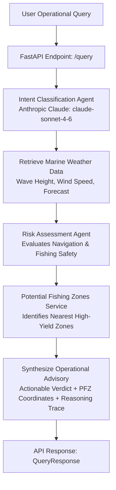

# ORCA Marine AI 🌊⚓

**ORCA Marine AI** is an intelligent maritime advisory platform that delivers real-time marine weather intelligence, navigational safety risk assessments, and Potential Fishing Zone (PFZ) advisories for artisanal fishermen and commercial mariners.

---

## 🌟 Key Features

- **🧠 Intent Classification Agent**: Powered by Anthropic Claude (`claude-sonnet-4-6`), queries are classified into domain intents (`safety_check`, `nearest_pfz`, `weather_conditions`, `general`) with automatic geographic location hint extraction.
- **🛡️ Marine Safety Risk Assessment Agent**: Evaluates complex marine conditions (wave heights, wind speeds, squall/storm risks) into clear risk tiers (`SAFE`, `CAUTION`, `UNSAFE`) with operational guidance.
- **🐟 Potential Fishing Zones (PFZ) Advisory**: Identifies thermal fronts, chlorophyll blooms, shelf breaks, and upwelling regions with distance calculations, depth estimates, and dominant target species.
- **🔍 Full Reasoning Trace & Source Attribution**: Every advisory response includes an end-to-end reasoning trace and attribution of all services and agents consulted.
- **⚡ High-Performance FastAPI Backend**: RESTful API with automated OpenAPI docs, CORS support, and Pydantic data validation.

---

## 🏗️ Architecture & Pipeline



---

## 📁 Repository Structure

```
ORCA/
├── README.md                           # Project documentation
├── backend/
│   ├── requirements.txt                # Python dependencies
│   └── app/
│       ├── __init__.py
│       ├── main.py                     # FastAPI application & /query pipeline
│       ├── agents/
│       │   ├── __init__.py
│       │   ├── intent_agent.py         # Claude-powered intent parser
│       │   └── risk_agent.py           # Marine safety risk evaluation agent
│       └── data/
│           ├── __init__.py
│           ├── mock_weather.py         # Marine weather data provider
│           └── mock_pfz.py             # Potential Fishing Zone data provider
└── frontend/                           # Client interface directory
```

---

## 🚀 Getting Started

### Prerequisites

- Python 3.10+
- Anthropic API Key (optional for fallback mode, required for live Claude intent parsing)

### 1. Clone & Setup Environment

```bash
cd backend

# Create and activate virtual environment
python3 -m venv venv
source venv/bin/activate  # On Windows: venv\Scripts\activate

# Install dependencies
pip install -r requirements.txt
```

### 2. Environment Configuration

Create a `.env` file in `backend/` (or set environment variables):

```bash
ANTHROPIC_API_KEY="your-anthropic-api-key-here"
```

> **Note:** If `ANTHROPIC_API_KEY` is not provided, the intent agent automatically falls back to built-in heuristic pattern matching to ensure zero downtime.

### 3. Run the Backend Server

```bash
uvicorn app.main:app --reload --host 0.0.0.0 --port 8000
```

The API will be available at `http://localhost:8000`. Interactive Swagger API docs are accessible at `http://localhost:8000/docs`.

---

## 📡 API Reference

### Health Check
- **Endpoint:** `GET /`
- **Response:**
  ```json
  {
    "status": "healthy",
    "service": "ORCA Marine AI Backend",
    "endpoints": ["/query"]
  }
  ```

---

### Marine Advisory Query
- **Endpoint:** `POST /query`
- **Request Body:**
  ```json
  {
    "location": {
      "lat": 18.9220,
      "lon": 72.8347
    },
    "date": "2026-08-24",
    "question": "Is it safe to fish near Mumbai today, and where are the closest fishing spots?"
  }
  ```

- **Response:**
  ```json
  {
    "answer": "Operational Advisory for (18.9220, 72.8347) on 2026-08-24:\n\n✅ Conditions are SAFE for navigation and fishing (clear weather, wave height 1.05m, wind speed 20.1 km/h).\n\nNearby Potential Fishing Zones (PFZ):\n- Shelf Break Zone D: 8.8 km away at (18.9612, 72.8941), depth ~65m, likely species: Kingfish & Seer Fish\n- Chlorophyll Bloom Zone B: 12.3 km away at (18.8351, 72.7812), depth ~45m, likely species: Sardines & Anchovies",
    "reasoning": [
      "Detected intent 'safety_check' (location hint: 'Mumbai') for question: 'Is it safe to fish near Mumbai today, and where are the closest fishing spots?'.",
      "Parsed query for location (18.9220, 72.8347) on date '2026-08-24'. Question: 'Is it safe to fish near Mumbai today, and where are the closest fishing spots?'.",
      "Retrieved marine weather data: forecast='clear', wave_height=1.05m, wind_speed=20.1 km/h.",
      "Assessed marine risk level as 'SAFE': SAFE CONDITIONS: Wave height is 1.05m (<=1.5m), wind speed is 20.1 km/h (<=40 km/h), with clear forecast. Normal marine and fishing activities may proceed.",
      "Identified 3 Potential Fishing Zones (PFZ). Nearest: Shelf Break Zone D (8.8 km away, Kingfish & Seer Fish), Chlorophyll Bloom Zone B (12.3 km away, Sardines & Anchovies).",
      "Synthesized advisory answer combining safety verdict, weather metrics, and fishing zone data."
    ],
    "sources_used": [
      "intent_agent",
      "mock_weather_service",
      "risk_assessment_agent",
      "mock_pfz_service"
    ]
  }
  ```

---

## 🎯 Intent Classification Types

| Intent Type | Description |
| :--- | :--- |
| `safety_check` | Queries asking if sea conditions are safe to navigate, sail, or fish. |
| `nearest_pfz` | Queries looking for potential fishing zones, fish aggregations, or productive spots. |
| `weather_conditions` | Queries asking for marine weather forecasts, wind speeds, wave heights, or sea states. |
| `general` | General maritime questions, navigational inquiries, or greetings. |

---

## 🛡️ Risk Assessment Rules

| Risk Level | Threshold Criteria | Recommended Action |
| :--- | :--- | :--- |
| **UNSAFE** | Wave height > 2.5m **OR** wind speed > 50 km/h **OR** `stormy` forecast | Strictly discourage sailing; do not venture to fishing zones. |
| **CAUTION** | Wave height > 1.5m **OR** wind speed > 40 km/h **OR** `rainy` forecast | Small vessels remain near shore; delay departure if necessary. |
| **SAFE** | Wave height ≤ 1.5m **AND** wind speed ≤ 40 km/h **AND** `clear` forecast | Normal maritime and fishing operations may proceed. |

---

## 📄 License

This project is licensed under the MIT License.
