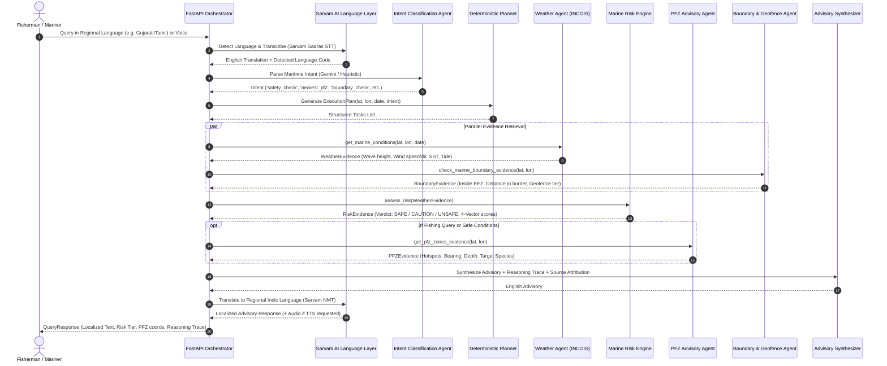

# ORCA Marine AI 🌊⚓

[](https://fastapi.tiangolo.com)
[](https://react.dev/)
[](https://www.typescriptlang.org/)
[](https://vitejs.dev/)
[](https://tailwindcss.com/)
[](https://leafletjs.com/)
[](https://pytest.org)
[](LICENSE)

**ORCA Marine AI** is an advanced autonomous maritime intelligence platform designed for artisanal fishermen, commercial mariners, coastal communities, and maritime authorities. It delivers real-time ocean state telemetry, decomposed 4-vector safety risk assessments, Potential Fishing Zone (PFZ) advisories, international maritime boundary geofencing, emergency SOS distress broadcasting, government policy circulars, and end-to-end regional voice and multilingual interaction across 10+ Indian coastal languages.

---

## 🌟 Key Features & Capabilities

- **🌊 Authoritative INCOIS Ocean State Forecast (OSF)**: Programmatic retrieval of Significant Wave Height ($HS$ in metres), Wind Speed ($UWND/VWND$ magnitude in $m/s$ and $km/h$), and Wind Direction (16-point cardinal & meteorological degrees) directly from the official **INCOIS NetCDF Subset Service (NCSS) / THREDDS catalog**.
- **⚡ Low-Bandwidth Coastal Geospatial Cache**: Ultra-compact query payloads (~130–160 bytes) with 0.05° (~5.5 km) spatial grid binning and spiral coastal land-mask search, allowing nearby coastal vessels to reuse forecasts with sub-millisecond retrieval latencies.
- **🛡️ Decomposed 4-Vector Marine Risk Engine**: Analyzes sea states across 4 independent vectors—Wave Height, Wind & Squall Risk, Storm Weather, and Swell Period—producing standardized operational tiers (`SAFE`, `CAUTION`, `UNSAFE`) tailored for small artisanal craft vs commercial trawlers.
- **🗺️ Marine Boundaries & EEZ Integration (Marine Regions / VLIZ)**: Official Exclusive Economic Zone (EEZ) boundaries from Flanders Marine Institute (VLIZ) World EEZ v12 via Web Feature Service (WFS) with pure-Python ray-casting containment testing and automated geofence proximity monitoring.
- **🐟 Potential Fishing Zones (PFZ) & Bathymetric Ecology**: Identifies thermal fronts, chlorophyll-a blooms, shelf breaks, and upwelling zones with distance/bearing calculations, depth estimates, and dominant target species (Kingfish, Seer Fish, Tuna, Mackerel, Sardines).
- **🎙️ Sarvam AI & Bhashini Voice & Multilingual Stack**:
  - **Speech-to-Text (STT)**: Sarvam Saaras v3 / v2 supporting speech in 22+ Indic languages + English.
  - **Text-to-Speech (TTS)**: Sarvam Bulbul v3 neural voice synthesis with authentic Indian voice personas (*Meera*, *Arvind*, *Kavya*, *Amartya*, *Ratan*, *Shashi*).
  - **Neural Machine Translation (NMT)** & Language Identification across 10+ coastal languages (Hindi, Gujarati, Marathi, Tamil, Telugu, Malayalam, Bengali, Odia, Kannada, Punjabi).
  - Dual fallback integration with Government of India **Bhashini** service.
- **🚨 Maritime Emergency SOS & Coastal Distress Hub**: Instant one-click SOS distress broadcasting with GPS routing to Maritime Rescue Coordination Centres (**MRCC Mumbai, MRCC Chennai, MRCC Port Blair**), automated **IMO-standard MAYDAY VHF Channel 16 transmission script** generation, and 24x7 maritime helplines (Coast Guard 1554, Coastal Police 1093, NDRF 1078).
- **📜 Government Circulars & Fisheries Policy Portal**: Interactive gazette notices, seasonal monsoon fishing ban advisories, PMMSY (Pradhan Mantri Matsya Sampada Yojana) subsidy schemes, transponder mandates, and official circular publishing.
- **📊 Super Admin Diagnostics & Fleet Operations**: Real-time service health monitoring, upstream latencies (INCOIS, Open-Meteo, Sarvam AI, VLIZ), user fleet management with Role-Based Access Control (`USER`, `GOVERNMENT`, `SUPER_ADMIN`), and Before-vs-After historical oceanographic telemetry comparisons.
- **🧭 Tactical GIS Dashboard (React 19 + Leaflet + Tailwind v4)**: Interactive nautical chart with multi-layer overlays (PFZ hotspots, EEZ boundary lines, international boundary buffer zones, Sea Surface Temperature heatmaps, chlorophyll distributions, wind barbs, wave vectors, vessel breadcrumbs), full reasoning trace inspection, and mobile bottom navigation.

---

## 🏗️ System Architecture

```mermaid
flowchart TD
    subgraph Client["Frontend Tactical GIS Dashboard (React 19 + Vite + Leaflet)"]
        UI[User Interface & Tactical Map]
        VoiceInput[Voice Input / Microphone]
        AudioOutput[Audio Playback / TTS]
        Modals[Emergency SOS / Govt Portal / Admin / Trace]
    end

    subgraph API_Gateway["FastAPI Application Layer (v1.4.0)"]
        RouterMain["Core Router (/query, /api/chat)"]
        RouterVoice["Voice & Speech Router (/api/voice/*)"]
        RouterMarine["Marine Telemetry Router (/api/marine/*)"]
        RouterBoundaries["Boundary & EEZ Router (/api/marine-boundaries/*)"]
        RouterEmergency["Emergency SOS Router (/api/emergency/*)"]
        RouterGovt["Government Portal Router (/api/government/*)"]
        RouterAdmin["Super Admin Router (/api/admin/*)"]
        RouterAuth["Auth & User Profile Router (/api/auth/*, /api/user/*)"]
    end

    subgraph Intelligence_Core["Multi-Agent Autonomous Orchestrator"]
        LangLayer["Language Layer (Sarvam AI / Bhashini NMT & STT)"]
        IntentAgent["Intent Classification Agent (Gemini / Claude / Heuristic)"]
        Planner["Deterministic Task Planner (6 Operational Rules)"]
        
        subgraph Specialized_Agents["Domain Specialist Agents"]
            WeatherAgent["Weather Agent"]
            RiskAgent["Risk Assessment Agent"]
            PFZAgent["PFZ Advisory Agent"]
            BoundaryAgent["Boundary & Geofence Agent"]
        end
        
        Synthesizer["Response Synthesizer & Reasoning Engine"]
    end

    subgraph Data_Providers["Authoritative Data & External Services"]
        INCOIS["INCOIS OSF / THREDDS NCSS"]
        OpenMeteo["Open-Meteo Marine API"]
        VLIZ["Marine Regions / VLIZ World EEZ v12"]
        SarvamService["Sarvam AI (Saaras STT & Bulbul TTS)"]
        BhashiniService["Bhashini Multilingual Platform"]
        LocalCache["Low-Bandwidth Geospatial Cache"]
        GeoJSON["Local EEZ & Boundary GeoJSON Store"]
    end

    %% Client to API
    UI -->|REST / JSON| RouterMain
    VoiceInput -->|Audio Bytes / Base64| RouterVoice
    RouterVoice -->|Audio Stream| AudioOutput
    Modals -->|REST Endpoints| API_Gateway

    %% API to Intelligence Core
    RouterMain --> LangLayer
    RouterVoice --> LangLayer
    LangLayer --> IntentAgent
    IntentAgent --> Planner
    Planner --> Specialized_Agents
    
    %% Agents to Data Providers
    WeatherAgent --> INCOIS
    WeatherAgent -.->|Fallback| OpenMeteo
    WeatherAgent --> LocalCache
    RiskAgent --> Specialized_Agents
    PFZAgent --> LocalCache
    BoundaryAgent --> VLIZ
    BoundaryAgent --> GeoJSON
    LangLayer --> SarvamService
    LangLayer -.->|Fallback| BhashiniService

    %% Synthesizer back to Response
    Specialized_Agents --> Synthesizer
    Synthesizer --> LangLayer
    LangLayer --> RouterMain
```



---

## 🤖 Multi-Agent Decision Framework

ORCA operates on a deterministic, contract-driven multi-agent architecture where specialist agents collaborate to produce verifiable operational guidance.



---

## 📁 Repository Structure

```
ORCA/
├── README.md                           # Main project documentation
├── data/
│   ├── geofences/
│   │   └── india_maritime_boundaries.json   # Indian Maritime Boundaries & MPAs
│   ├── marine_regions/
│   │   └── eez_mrgid_8480.geojson           # VLIZ World EEZ v12 India GeoJSON cache
│   └── pfz/
│       └── pfz_maharashtra.json             # INCOIS-derived PFZ coordinates & species
├── backend/
│   ├── requirements.txt                # Python backend dependencies
│   ├── benchmark_performance.py        # Latency & throughput benchmarking script
│   ├── app/
│   │   ├── __init__.py
│   │   ├── main.py                     # FastAPI application & /query orchestrator
│   │   ├── agents/                     # Specialist AI agents
│   │   │   ├── __init__.py
│   │   │   ├── boundary_agent.py       # VLIZ EEZ & boundary evaluation agent
│   │   │   ├── geofence_agent.py       # Maritime zone & MPA geofence agent
│   │   │   ├── intent_agent.py         # LLM & heuristic intent parser
│   │   │   ├── pfz_agent.py            # Potential Fishing Zone evidence builder
│   │   │   ├── risk_agent.py           # 4-Vector marine safety risk matrix engine
│   │   │   └── weather_agent.py        # Weather evidence collector
│   │   ├── data/                       # Providers & low-bandwidth caching
│   │   │   ├── __init__.py
│   │   │   ├── geofence/               # Spatial boundary providers
│   │   │   │   ├── base.py
│   │   │   │   └── spatial_provider.py # Point-in-polygon containment engine
│   │   │   ├── pfz/                    # Potential Fishing Zone data providers
│   │   │   │   ├── base.py
│   │   │   │   └── mock.py             # INCOIS PFZ dataset provider
│   │   │   └── weather/                # Marine ocean state providers
│   │   │       ├── base.py             # Abstract WeatherProvider interface
│   │   │       ├── cache.py            # Low-bandwidth geospatial spatial-binning cache
│   │   │       ├── incois.py           # Live INCOIS OSF NCSS / THREDDS provider
│   │   │       ├── mock.py             # MockWeatherProvider for unit tests
│   │   │       └── open_meteo.py       # Open-Meteo Marine API live provider
│   │   ├── models/                     # Pydantic schema contracts
│   │   │   ├── __init__.py
│   │   │   ├── admin_models.py         # System health & historical comparison models
│   │   │   ├── agent_models.py         # Structured evidence contracts & risk models
│   │   │   ├── emergency_models.py     # SOS distress & emergency contact schemas
│   │   │   ├── government_models.py    # Government circulars & document models
│   │   │   ├── notification_models.py  # Safety notification & alert models
│   │   │   └── user_models.py          # User profile, auth, & location models
│   │   ├── routers/                    # Dedicated REST API routers
│   │   │   ├── __init__.py
│   │   │   ├── admin.py                # Super Admin diagnostics & user fleet management
│   │   │   ├── auth.py                 # JWT authentication & user profile endpoints
│   │   │   ├── emergency.py            # SOS distress broadcasting & MRCC routing
│   │   │   ├── government.py           # Policy circulars & announcement management
│   │   │   ├── location.py             # GPS coastal validation & coordinate updates
│   │   │   ├── marine_boundaries.py    # VLIZ World EEZ v12 boundary endpoints
│   │   │   ├── notifications.py        # Safety alerts & notification center
│   │   │   ├── pfz.py                  # PFZ hotspot discovery & analytics
│   │   │   └── voice.py                # Sarvam AI STT & TTS speech endpoints
│   │   └── services/                   # Business logic & external service connectors
│   │       ├── __init__.py
│   │       ├── bhashini.py             # Bhashini multilingual translation service
│   │       ├── marine_boundaries.py    # WFS client & ray-casting boundary engine
│   │       ├── planner.py              # Deterministic 6-rule Multi-Agent Task Planner
│   │       ├── admin/                  # Super Admin service
│   │       ├── auth/                   # Password hashing & JWT token services
│   │       ├── emergency/              # SOS distress coordinator & MAYDAY script engine
│   │       ├── government/             # Policy documents & announcement repository
│   │       ├── language/               # Sarvam AI Saaras STT, Bulbul TTS, & NMT
│   │       ├── location/               # Geodetic validation & coastal distance calculator
│   │       └── notifications/          # Automated safety alert evaluator
│   └── tests/                          # Comprehensive Pytest test suite (145 tests)
│       ├── test_admin_and_historical.py
│       ├── test_agent_contracts.py
│       ├── test_auth.py
│       ├── test_bhashini.py
│       ├── test_chat.py
│       ├── test_emergency.py
│       ├── test_geofence.py
│       ├── test_government.py
│       ├── test_incois_provider.py
│       ├── test_incois_query.py
│       ├── test_location_validation.py
│       ├── test_marine_boundaries.py
│       ├── test_marine_cache.py
│       ├── test_marine_endpoints.py
│       ├── test_notifications.py
│       ├── test_pfz_api.py
│       ├── test_planner.py
│       ├── test_query.py
│       ├── test_risk_engine.py
│       ├── test_sarvam_language.py
│       └── test_weather_provider.py
└── frontend/                           # React 19 + Vite + Leaflet + Tailwind CSS
    ├── package.json
    ├── vite.config.ts
    ├── src/
    │   ├── App.tsx                     # Main layout, stage manager, & state hub
    │   ├── i18n.ts                     # 11-language Indic localization dictionary
    │   ├── types.ts                    # Frontend TypeScript interfaces
    │   ├── components/                 # Tactical UI & modal components
    │   │   ├── AgentTraceModal.tsx     # Full reasoning trace & source attribution inspector
    │   │   ├── AuthModal.tsx           # User authentication & registration modal
    │   │   ├── ChatPanel.tsx           # Multi-turn conversational drawer with voice & audio
    │   │   ├── ControlBar.tsx          # Quick actions & port selector bar
    │   │   ├── CurrentMarineStatusCard.tsx # Ocean state telemetry summary card
    │   │   ├── EmergencySOSModal.tsx   # SOS distress broadcast modal & MAYDAY generator
    │   │   ├── FishAnalyticsModal.tsx  # PFZ species distribution & bathymetry modal
    │   │   ├── ForecastHorizonTimeline.tsx # Hourly forecast timeline (24h/48h)
    │   │   ├── GisLayersPanel.tsx      # Multi-layer GIS overlay controls
    │   │   ├── GovernmentPortalModal.tsx # Gazette notices & policy document viewer
    │   │   ├── LandingPage.tsx         # Responsive landing hero with live ticker
    │   │   ├── LanguageSelectorModal.tsx # Indic regional language selector
    │   │   ├── LocationPermissionModal.tsx # GPS permission & coastal verification
    │   │   ├── MarineMap.tsx           # Leaflet nautical chart with dynamic GIS layers
    │   │   ├── MobileBottomNav.tsx     # Mobile bottom tab navigation
    │   │   ├── NotificationCenterModal.tsx # Safety alerts center
    │   │   ├── QuickPromptsGrid.tsx    # High-frequency operational prompt shortcuts
    │   │   ├── SuperAdminModal.tsx     # Fleet management & historical telemetry comparison
    │   │   ├── TerminologyExplainerModal.tsx # Oceanographic terminology glossary
    │   │   └── TopHeader.tsx           # Global navigation header with live badges
    │   └── services/
    │       └── api.ts                  # Axios/Fetch API client for ORCA backend
```

---

## 📡 Complete REST API Reference

The backend exposes automated OpenAPI documentation at `/docs` (Swagger UI) and `/redoc`.

### 1. Operational Advisory & Chat

| Method | Endpoint | Description |
| :--- | :--- | :--- |
| `POST` | `/query` | Executes full multi-agent workflow: intent classification, planning, retrieval, risk synthesis, and Indic translation. |
| `POST` | `/api/chat` | Multi-turn conversational chat with session memory, language persistence, and structured reasoning. |
| `GET` | `/` | Service health status, active upstream providers, and registered endpoints. |

#### Example `/query` Request & Response:

```bash
curl -X POST "http://localhost:8000/query" \
  -H "Content-Type: application/json" \
  -d '{
    "location": {"lat": 18.9220, "lon": 72.8347},
    "date": "2026-08-25",
    "question": "ક્યાં માછીમારી કરવી સુરક્ષિત છે અને નજીકના ઝોન કયા છે?",
    "language": "gu"
  }'
```

```json
{
  "answer": "તારીખ 2026-08-25 ના રોજ (18.9220, 72.8347) માટે સલાહ:\n\n✅ સમુદ્રની સ્થિતિ નેવિગેશન અને માછીમારી માટે સુરક્ષિત (SAFE) છે (તરંગ ઊંચાઈ: 1.05m, પવન ગતિ: 20.1 km/h).\n\nનજીકના સંભવિત માછીમારી ઝોન (PFZ):\n- Shelf Break Zone D: 8.8 km દૂર (ઊંડાઈ: ~65m, મુખ્ય માછલી: કિંગફિશ અને સુરમાઈ)\n- Chlorophyll Bloom Zone B: 12.3 km દૂર (ઊંડાઈ: ~45m, મુખ્ય માછલી: તારલી અને ઓલીયા)",
  "language": "gu",
  "language_name": "Gujarati",
  "risk_level": "safe",
  "risk_profile": {
    "overall_risk": "safe",
    "wave_risk": "safe",
    "wind_risk": "safe",
    "weather_risk": "safe",
    "swell_risk": "safe"
  },
  "weather": {
    "wave_height_m": 1.05,
    "wind_speed_kmh": 20.1,
    "wind_direction_cardinal": "WSW",
    "forecast": "clear",
    "source": "INCOIS_OSF_LIVE",
    "is_mock": false
  },
  "nearest_pfz": [
    {
      "name": "Shelf Break Zone D",
      "latitude": 18.9612,
      "longitude": 72.8941,
      "distance_km": 8.8,
      "depth_m": 65,
      "species": ["Kingfish", "Seer Fish"]
    }
  ],
  "reasoning": [
    "Language Layer (Sarvam AI): Identified language as 'Gujarati' (gu). Translated user query to English: 'Where is it safe to fish and what are the nearest zones?'.",
    "Detected intent 'safety_check' (location hint: 'Mumbai') for question: 'Where is it safe to fish and what are the nearest zones?'.",
    "Generated execution plan with 4 tasks: weather_agent:get_marine_conditions, risk_agent:assess_risk, pfz_agent:find_nearest_zones, boundary_agent:check_boundary.",
    "Retrieved marine weather data from INCOIS: forecast='clear', wave_height=1.05m, wind_speed=20.1 km/h.",
    "Assessed marine risk level as 'SAFE': Wave height is 1.05m (<=1.5m), wind speed is 20.1 km/h (<=40 km/h).",
    "Identified 3 Potential Fishing Zones (PFZ). Nearest: Shelf Break Zone D (8.8 km away).",
    "Synthesized advisory answer combining safety verdict, weather metrics, and fishing zone data.",
    "Translated synthesized operational advice back to Gujarati."
  ],
  "sources_used": [
    "sarvam_ai_language_service",
    "intent_agent",
    "planner",
    "incois_osf_provider",
    "risk_assessment_agent",
    "pfz_provider",
    "marine_boundaries_service"
  ]
}
```

---

### 2. Marine Conditions & Ocean State Telemetry

| Method | Endpoint | Description |
| :--- | :--- | :--- |
| `GET` | `/api/marine/conditions?lat=18.922&lon=72.834` | Direct endpoint returning normalized wave heights, wind vectors, SST, and tide state. |
| `GET` | `/api/marine/risk?lat=18.922&lon=72.834` | Evaluates decomposed 4-vector environmental risk matrix with trend diagnosis. |
| `GET` | `/api/marine/forecast?lat=18.922&lon=72.834` | Returns hourly forecast horizon (24h/48h) for wave and wind conditions. |
| `GET` | `/api/marine/historical-comparison?lat=18.922&lon=72.834&period_hours=24` | Before-vs-After oceanographic comparison metrics and variance analysis. |

---

### 3. Voice & Multilingual Speech (Sarvam AI / Bhashini)

| Method | Endpoint | Description |
| :--- | :--- | :--- |
| `POST` | `/api/voice/transcribe` | Transcribes uploaded multipart audio file via **Sarvam Saaras STT** (supports 22+ Indic languages). |
| `POST` | `/api/voice/transcribe-base64` | Transcribes Base64-encoded audio payload from web/mobile clients. |
| `POST` | `/api/voice/speak` | Synthesizes regional Indic speech using **Sarvam Bulbul v3** neural voices (*Meera*, *Arvind*, *Kavya*). |
| `GET` | `/api/voice/speakers` | Lists available Sarvam voice personas and supported language mappings. |
| `GET` | `/api/languages` | Returns list of supported Indian coastal languages. |
| `POST` | `/api/detect-language` | Detects language of input text with ISO and BCP-47 codes. |
| `POST` | `/api/translate` | Translates text between Indic languages and English. |

---

### 4. Marine Boundaries & Geofencing (Marine Regions / VLIZ)

| Method | Endpoint | Description |
| :--- | :--- | :--- |
| `GET` | `/api/marine-boundaries/info` | Returns dataset version (`World EEZ v12`), provenance, and WFS endpoint details. |
| `GET` | `/api/marine-boundaries/eez?mrgid=8480` | Returns GeoJSON FeatureCollection for the Indian Exclusive Economic Zone. |
| `GET` | `/api/marine-boundaries/check?lat=18.922&lon=72.500` | Evaluates coordinates, distance to boundary, and geofence status (`SAFE`, `WARNING`, `CRITICAL`). |
| `POST` | `/api/marine-boundaries/check` | JSON POST evaluation for vessel coordinate monitoring. |
| `GET` | `/api/geofences?lat=18.922&lon=72.500` | Returns spatial evaluation for all registered maritime boundaries and MPAs. |

---

### 5. Emergency SOS & Maritime Distress

| Method | Endpoint | Description |
| :--- | :--- | :--- |
| `GET` | `/api/emergency/contacts?region=Maharashtra` | Returns official 24x7 distress helplines (Coast Guard 1554, Coastal Police 1093, NDRF 1078). |
| `POST` | `/api/emergency/sos` | Broadcasts instant SOS distress signal with MRCC routing and IMO MAYDAY VHF transcript generation. |
| `GET` | `/api/emergency/sos/active` | Lists active SOS distress beacons for maritime search & rescue monitoring desks. |

#### Example `/api/emergency/sos` Payload:

```json
{
  "vessel_id": "IND-MH-01-9823",
  "vessel_name": "Matsya Kanya III",
  "lat": 18.7502,
  "lon": 72.4105,
  "nature_of_distress": "Engine Failure & Flooding in Rough Seas",
  "persons_on_board": 5,
  "emergency_contact": "+91 98765 43210"
}
```

---

### 6. Government Circulars & Policy Portal

| Method | Endpoint | Description |
| :--- | :--- | :--- |
| `GET` | `/api/government/announcements?state=Gujarat` | Lists official circulars from Ministry of Fisheries, Coast Guard, IMD, and State departments. |
| `GET` | `/api/government/announcements/{id}` | Retrieves full gazette text, validity period, and category metadata for an announcement. |
| `POST` | `/api/government/announcements` | Publishes a new government circular (Requires `GOVERNMENT` or `SUPER_ADMIN` role). |
| `GET` | `/api/government/documents` | Returns official policy handbooks, PMMSY guidelines, and maritime regulations. |

---

### 7. Super Admin & User Fleet Management

| Method | Endpoint | Description |
| :--- | :--- | :--- |
| `GET` | `/api/admin/system-health` | Returns real-time service health, upstream latencies (INCOIS, Open-Meteo, Sarvam AI), memory usage, and uptime. |
| `GET` | `/api/admin/users` | Lists registered fishermen, mariners, and officials. |
| `PATCH` | `/api/admin/users/{user_id}/role` | Updates account role (`USER`, `GOVERNMENT`, `SUPER_ADMIN`). |

---

### 8. Location & Safety Notifications

| Method | Endpoint | Description |
| :--- | :--- | :--- |
| `POST` | `/api/location/validate` | Validates GPS coordinates against India boundary and coastal belt (<= 100 km). |
| `POST` | `/api/location/update` | Updates active vessel location for session. |
| `GET` | `/api/notifications` | Retrieves active safety alerts (IMBL warnings, storm alerts, MPA notifications). |
| `PATCH` | `/api/notifications/{id}/read` | Marks a specific notification as read. |
| `POST` | `/api/notifications/read-all` | Marks all notifications as read for current user. |
| `POST` | `/api/notifications/check` | Evaluates coordinates against safety thresholds and returns fresh alerts. |

---

## 🛡️ Risk Assessment Rules & Thresholds

ORCA evaluates four independent physical risk vectors to construct the composite risk verdict:

| Metric | Safe Tier (🟢) | Caution Tier (🟡) | Unsafe Tier (🔴) | Severe / Storm Tier (🚨) |
| :--- | :--- | :--- | :--- | :--- |
| **Significant Wave Height ($HS$)** | $\le 1.5\text{ m}$ | $1.5\text{ m} < HS \le 2.5\text{ m}$ | $2.5\text{ m} < HS \le 4.0\text{ m}$ | $> 4.0\text{ m}$ |
| **Wind Speed** | $\le 40\text{ km/h}$ ($\le 11\text{ m/s}$) | $40\text{ km/h} < W \le 50\text{ km/h}$ | $50\text{ km/h} < W \le 65\text{ km/h}$ | $> 65\text{ km/h}$ ($> 18\text{ m/s}$) |
| **Swell Period** | $6\text{s} - 12\text{s}$ (Normal) | $12\text{s} - 16\text{s}$ (High Energy) | $> 16\text{s}$ (Heavy Long Swell) | Severe breaker hazard |
| **Forecast State** | `clear`, `calm` | `choppy`, `moderate`, `rainy` | `squally`, `rough`, `stormy` | `cyclonic`, `gale` |
| **Recommended Action** | Normal operations permitted. | Small craft exercise caution; remain within 10 NM. | Strictly discourage sailing; recall vessels. | Complete harbour shutdown; deploy SAR standby. |

---

## 🚀 Getting Started & Setup Guide

### Prerequisites

- **Python 3.10+** (Tested on Python 3.11, 3.12, 3.14)
- **Node.js 18+** & **npm**
- (Optional) **Sarvam AI API Key** for production-grade Indic STT, TTS, and NMT.
- (Optional) **Google Gemini API Key** or **Anthropic API Key** for LLM intent parsing.

> **Zero-Downtime Fallbacks:** If external API keys are omitted, ORCA automatically switches to built-in heuristic intent classification, local Indic translation dictionaries, and open fallback data providers.

---

### 1. Backend Setup

```bash
# Navigate to backend directory
cd backend

# Create and activate a virtual environment
python3 -m venv venv
source venv/bin/activate  # On Windows: venv\Scripts\activate

# Install dependencies
pip install -r requirements.txt
```

#### Environment Configuration (`backend/.env`)

Create a `.env` file in the `backend/` directory:

```ini
# ==========================================
# ORCA Marine AI Backend Configuration
# ==========================================

# LLM Providers (Optional - Heuristic fallback available)
GEMINI_API_KEY=your_gemini_api_key_here
# ANTHROPIC_API_KEY=your_anthropic_api_key_here

# Sarvam AI Voice & Language Service (Optional - Mock/Bhashini fallback available)
SARVAM_API_KEY=your_sarvam_api_key_here
SARVAM_BASE_URL=https://api.sarvam.ai
SARVAM_TIMEOUT_SEC=10.0

# Bhashini / ULCA Credentials (Optional fallback)
# BHASHINI_USER_ID=your_bhashini_user_id
# BHASHINI_API_KEY=your_bhashini_api_key
# BHASHINI_INFERENCE_API_KEY=your_inference_api_key

# INCOIS Ocean State Forecast Settings
INCOIS_BASE_URL=https://incois.gov.in
INCOIS_TIMEOUT_SEC=4.0

# Security & Coastal Validation
ORCA_JWT_SECRET=orca_marine_ai_jwt_secret_key_sih_2026_coastal_safety
ORCA_INTELLIGENCE_RADIUS_KM=100.0
```

#### Run the Backend Server

```bash
uvicorn app.main:app --reload --host 0.0.0.0 --port 8000
```

The API will be available at `http://localhost:8000`. Swagger documentation is at `http://localhost:8000/docs`.

---

### 2. Frontend Setup

```bash
# Open a new terminal and navigate to frontend
cd frontend

# Install Node dependencies
npm install

# Start Vite development server
npm run dev
```

The frontend dashboard will be live at `http://localhost:5173`.

---

## 🧪 Testing & Quality Assurance

The ORCA backend contains a comprehensive test suite of **222 unit and integration tests** (100% passing) verifying multi-agent planning, ISRO satellite ocean analytics, PFZ discovery, 4-vector risk assessment, VLIZ EEZ boundary ray-casting, multilingual translations across 11 Indic languages, proactive hazard alerts, and the reliable recommendations & reasoning engine.

```bash
# Run all backend tests
cd backend
python3 -m pytest
```

```
============================= test session starts ==============================
platform darwin -- Python 3.14.4, pytest-9.0.3, pluggy-1.6.0
rootdir: /Users/darshilmodi/Desktop/ORCA/backend
configfile: pytest.ini
testpaths: tests
collected 222 items

tests/test_admin_and_historical.py .......                               [  3%]
tests/test_agent_contracts.py .....                                      [  5%]
tests/test_auth.py .......                                               [  8%]
tests/test_bhashini.py ............                                      [ 13%]
tests/test_chat.py .......                                               [ 17%]
tests/test_database.py ..........                                        [ 21%]
tests/test_demo_scenario.py ....                                         [ 23%]
tests/test_emergency.py ........                                         [ 27%]
tests/test_geofence.py ......                                            [ 29%]
tests/test_geofence_agent.py ....                                        [ 31%]
tests/test_government.py .........                                       [ 35%]
tests/test_hazard_agent.py ...                                           [ 36%]
tests/test_historical_observations.py ...                                [ 38%]
tests/test_incois_provider.py ........                                   [ 41%]
tests/test_incois_query.py .....                                         [ 44%]
tests/test_ingestion_service.py ..                                       [ 45%]
tests/test_location_validation.py .......                                [ 48%]
tests/test_marine_boundaries.py ..........                               [ 52%]
tests/test_marine_cache.py ....                                          [ 54%]
tests/test_marine_endpoints.py .....                                     [ 56%]
tests/test_notifications.py .......                                      [ 59%]
tests/test_ocean_analytics_and_isro_queries.py .............             [ 65%]
tests/test_pfz_api.py ..                                                 [ 66%]
tests/test_planner.py ......                                             [ 69%]
tests/test_query.py ......                                               [ 72%]
tests/test_recommendations_and_reasoning.py .........                    [ 76%]
tests/test_resilient_cache.py .......                                    [ 79%]
tests/test_risk_engine.py ......                                         [ 81%]
tests/test_route_agent.py ..                                             [ 82%]
tests/test_sarvam_language.py .............                              [ 88%]
tests/test_sarvam_lid.py ..............                                  [ 95%]
tests/test_sarvam_live.py ....                                           [ 96%]
tests/test_simulation_agent.py ..                                        [ 97%]
tests/test_weather_provider.py .....                                     [100%]

================== 222 passed, 1 warning in 145.41s (0:02:25) ==================
```

---

## 🌐 Supported Indian Coastal Languages

| Language Code | Language Name | Native Script | Voice STT (Saaras) | Voice TTS (Bulbul) | NMT Translation |
| :--- | :--- | :--- | :---: | :---: | :---: |
| `gu` | Gujarati | ગુજરાતી | ✅ | ✅ | ✅ |
| `hi` | Hindi | हिन्दी | ✅ | ✅ | ✅ |
| `mr` | Marathi | मराठी | ✅ | ✅ | ✅ |
| `ta` | Tamil | தமிழ் | ✅ | ✅ | ✅ |
| `te` | Telugu | తెలుగు | ✅ | ✅ | ✅ |
| `ml` | Malayalam | മലയാളം | ✅ | ✅ | ✅ |
| `bn` | Bengali | বাংলা | ✅ | ✅ | ✅ |
| `or` / `od` | Odia | ଓଡ଼ିଆ | ✅ | ✅ | ✅ |
| `kn` | Kannada | ಕನ್ನಡ | ✅ | ✅ | ✅ |
| `pa` | Punjabi | ਪੰਜਾਬੀ | ✅ | ✅ | ✅ |
| `en` | English | English | ✅ | ✅ | ✅ |

---

## 🏛️ Institutional Data Attributions

- **INCOIS (Indian National Centre for Ocean Information Services)**: Ministry of Earth Sciences, Govt. of India (Ocean State Forecast WW3 NCSS services & Potential Fishing Zone advisories).
- **Marine Regions / Flanders Marine Institute (VLIZ)**: World EEZ v12 dataset (MRGID 8480, Creative Commons Attribution 4.0 International).
- **Sarvam AI**: Saaras Speech-to-Text & Bulbul Neural Text-to-Speech models for Indian regional languages.
- **Digital India Bhashini Division**: Ministry of Electronics and Information Technology (MeitY), Govt. of India.
- **Open-Meteo**: Global marine weather numerical models (Copernicus Marine / ECMWF).

---

## 📄 License

This project is licensed under the **MIT License**. See the [LICENSE](LICENSE) file for details.


