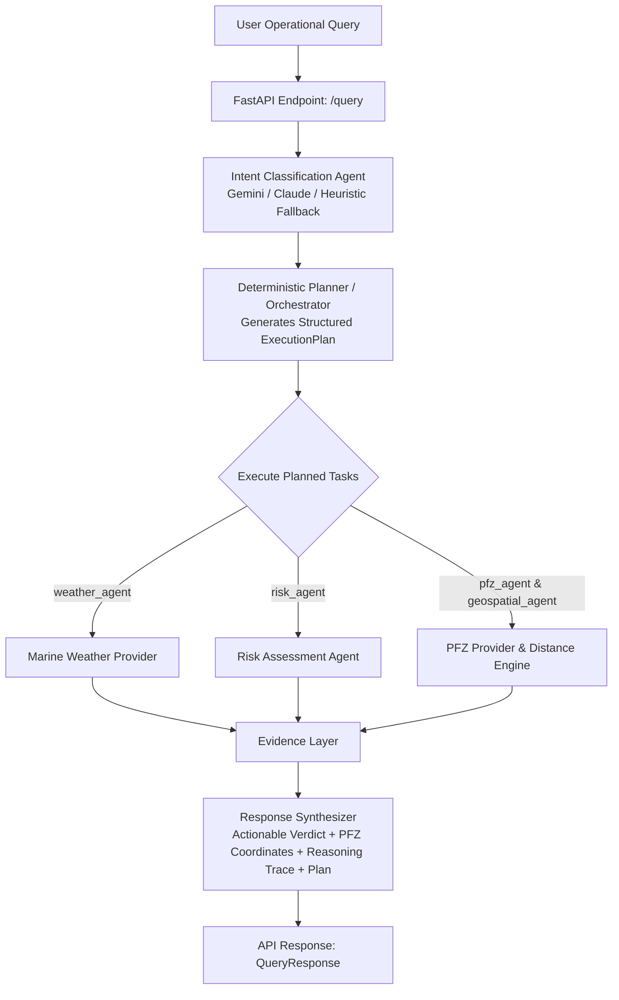
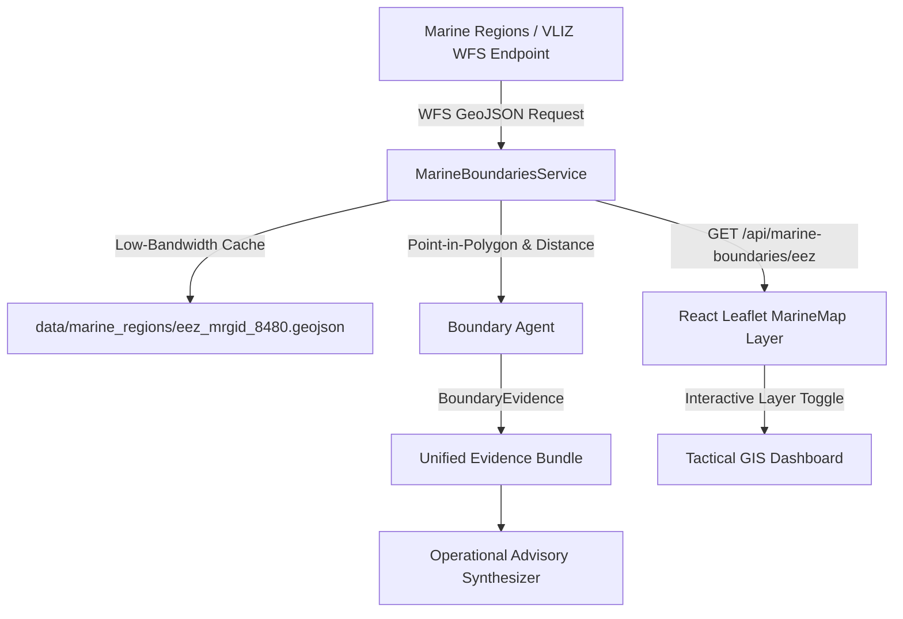

# ORCA Marine AI 🌊⚓

**ORCA Marine AI** is an intelligent maritime advisory platform that delivers real-time marine weather intelligence, navigational safety risk assessments, and Potential Fishing Zone (PFZ) advisories for artisanal fishermen and commercial mariners.

---

- **🌊 Real INCOIS Ocean State Forecast (OSF)**: Authoritative operational Significant Wave Height ($HS$ in metres), Wind Speed ($m/s$ and $km/h$), and Wind Direction ($16$-point cardinal & meteorological degrees) retrieved programmatically via official INCOIS NetCDF Subset Service (NCSS) / THREDDS catalog.
- **⚡ Low-Bandwidth Coastal Geospatial Cache**: Compact query payloads (~130–160 bytes) with 0.05° (~5.5 km) spatial grid normalization allowing nearby vessels to reuse forecasts with sub-millisecond retrieval latencies.
- **🛡️ Marine Safety Risk Assessment Agent**: Evaluates complex marine conditions (wave heights, wind speeds, squall/storm risks) into clear risk tiers (`SAFE`, `CAUTION`, `UNSAFE`) with operational guidance.
- **🗺️ Marine Boundaries & EEZ Integration (Marine Regions / VLIZ)**: Official Exclusive Economic Zone boundaries from Flanders Marine Institute (VLIZ) World EEZ v12 via Web Feature Service (WFS) with spatial containment testing and automated geofence distance monitoring.
- **🐟 Potential Fishing Zones (PFZ) Advisory**: Identifies thermal fronts, chlorophyll blooms, shelf breaks, and upwelling regions with distance calculations, depth estimates, and dominant target species.
- **🌐 Bhashini Multilingual Layer**: End-to-end voice and text intelligence supporting 10+ Indian coastal languages (Hindi, Gujarati, Marathi, Tamil, Telugu, Malayalam, Bengali, Odia, etc.).
- **🔍 Full Reasoning Trace & Source Attribution**: Every advisory response includes an end-to-end reasoning trace and attribution of all services and agents consulted (`is_mock=False` for INCOIS).
- **⚡ High-Performance FastAPI Backend**: RESTful API with automated OpenAPI docs, CORS support, and Pydantic data validation.

---

## 🏗️ Architecture & Pipeline



---

## 📁 Repository Structure

```
ORCA/
├── README.md                           # Project documentation
├── data/
│   └── pfz/
│       └── pfz_maharashtra.json        # INCOIS-derived PFZ dataset
├── backend/
│   ├── requirements.txt                # Python dependencies
│   ├── app/
│   │   ├── __init__.py
│   │   ├── main.py                     # FastAPI application & /query orchestrator
│   │   ├── models/
│   │   │   ├── __init__.py
│   │   │   └── agent_models.py         # Structured evidence contracts (Pydantic)
│   │   ├── agents/
│   │   │   ├── __init__.py
│   │   │   ├── intent_agent.py         # Intent parsing agent
│   │   │   ├── weather_agent.py        # Weather evidence builder
│   │   │   ├── pfz_agent.py            # PFZ advisory evidence builder
│   │   │   └── risk_agent.py           # Marine safety risk evaluation agent
│   │   ├── data/
│   │   │   ├── __init__.py             # Provider exports
│   │   │   ├── weather/
│   │   │   │   ├── __init__.py
│   │   │   │   ├── base.py             # Abstract WeatherProvider interface
│   │   │   │   ├── mock.py             # MockWeatherProvider implementation
│   │   │   │   └── open_meteo.py       # Live Open-Meteo marine weather provider
│   │   │   └── pfz/
│   │   │       ├── __init__.py
│   │   │       ├── base.py             # Abstract PFZProvider interface
│   │   │       └── mock.py             # MockPFZProvider implementation (INCOIS)
│   │   └── services/
│   │       ├── __init__.py
│   │       ├── bhashini.py             # Multilingual NMT & language detection
│   │       └── planner.py              # Deterministic multi-agent Planner
│   └── tests/
│       ├── __init__.py
│       ├── test_agent_contracts.py     # Pydantic contract validation tests
│       ├── test_bhashini.py            # Multilingual Bhashini tests
│       ├── test_chat.py                # Conversational chat tests
│       ├── test_pfz_api.py             # INCOIS PFZ REST endpoint tests
│       ├── test_planner.py             # Planner unit tests (6 rules)
│       ├── test_query.py               # End-to-end /query integration tests
│       └── test_weather_provider.py    # Open-Meteo live weather provider tests
└── frontend/                           # React + Leaflet tactical GIS dashboard
```

---

## 🚀 Getting Started

### Prerequisites

- Python 3.10+
- Gemini API Key (Free tier from [Google AI Studio](https://aistudio.google.com/app/apikey)) or Anthropic API Key

### 1. Clone & Setup Environment

```bash
cd backend

# Create and activate virtual environment
python3 -m venv venv
source venv/bin/activate  # On Windows: venv\Scripts\activate

# Install dependencies
pip install -r requirements.txt
```

### 2. Environment Configuration

Create a `.env` file in `backend/`:

```bash
# Using Google Gemini API (Free Tier)
echo "GEMINI_API_KEY=your_gemini_api_key_here" > .env

# Alternatively, using Anthropic API
# echo "ANTHROPIC_API_KEY=your_anthropic_api_key_here" > .env
```

> **Note:** If no API key is provided, the intent agent automatically falls back to built-in heuristic pattern matching to ensure zero downtime.

### 3. Run the Backend Server

```bash
uvicorn app.main:app --reload --host 0.0.0.0 --port 8000
```

The API will be available at `http://localhost:8000`. Interactive Swagger API docs are accessible at `http://localhost:8000/docs`.

### 4. Test with cURL

```bash
curl -X POST "http://localhost:8000/query" \
  -H "Content-Type: application/json" \
  -d '{
    "location": {"lat": 18.9220, "lon": 72.8347},
    "date": "2026-08-24",
    "question": "Is it safe to fish near Mumbai today, and where are the closest fishing spots?"
  }'
```

---

## 📡 API Reference

### Health Check
- **Endpoint:** `GET /`
- **Response:**
  ```json
  {
    "status": "healthy",
    "service": "ORCA Marine AI Backend",
    "endpoints": ["/query"]
  }
  ```

---

### Marine Advisory Query
- **Endpoint:** `POST /query`
- **Request Body:**
  ```json
  {
    "location": {
      "lat": 18.9220,
      "lon": 72.8347
    },
    "date": "2026-08-24",
    "question": "Is it safe to fish near Mumbai today, and where are the closest fishing spots?"
  }
  ```

- **Response:**
  ```json
  {
    "answer": "Operational Advisory for (18.9220, 72.8347) on 2026-08-24:\n\n✅ Conditions are SAFE for navigation and fishing (clear weather, wave height 1.05m, wind speed 20.1 km/h).\n\nNearby Potential Fishing Zones (PFZ):\n- Shelf Break Zone D: 8.8 km away at (18.9612, 72.8941), depth ~65m, likely species: Kingfish & Seer Fish\n- Chlorophyll Bloom Zone B: 12.3 km away at (18.8351, 72.7812), depth ~45m, likely species: Sardines & Anchovies",
    "reasoning": [
      "Detected intent 'safety_check' (location hint: 'Mumbai') for question: 'Is it safe to fish near Mumbai today, and where are the closest fishing spots?'.",
      "Parsed query for location (18.9220, 72.8347) on date '2026-08-24'. Question: 'Is it safe to fish near Mumbai today, and where are the closest fishing spots?'.",
      "Retrieved marine weather data: forecast='clear', wave_height=1.05m, wind_speed=20.1 km/h.",
      "Assessed marine risk level as 'SAFE': SAFE CONDITIONS: Wave height is 1.05m (<=1.5m), wind speed is 20.1 km/h (<=40 km/h), with clear forecast. Normal marine and fishing activities may proceed.",
      "Identified 3 Potential Fishing Zones (PFZ). Nearest: Shelf Break Zone D (8.8 km away, Kingfish & Seer Fish), Chlorophyll Bloom Zone B (12.3 km away, Sardines & Anchovies).",
      "Synthesized advisory answer combining safety verdict, weather metrics, and fishing zone data."
    ],
    "sources_used": [
      "intent_agent",
      "mock_weather_service",
      "risk_assessment_agent",
      "mock_pfz_service"
    ]
  }
  ```

---

## 🎯 Intent Classification Types

| Intent Type | Description |
| :--- | :--- |
| `safety_check` | Queries asking if sea conditions are safe to navigate, sail, or fish. |
| `nearest_pfz` | Queries looking for potential fishing zones, fish aggregations, or productive spots. |
| `weather_conditions` | Queries asking for marine weather forecasts, wind speeds, wave heights, or sea states. |
| `general` | General maritime questions, navigational inquiries, or greetings. |

---

## 🛡️ Risk Assessment Rules

| Risk Level | Threshold Criteria | Recommended Action |
| :--- | :--- | :--- |
| **UNSAFE** | Wave height > 2.5m **OR** wind speed > 50 km/h **OR** `stormy` forecast | Strictly discourage sailing; do not venture to fishing zones. |
| **CAUTION** | Wave height > 1.5m **OR** wind speed > 40 km/h **OR** `rainy` forecast | Small vessels remain near shore; delay departure if necessary. |
| **SAFE** | Wave height ≤ 1.5m **AND** wind speed ≤ 40 km/h **AND** `clear` forecast | Normal maritime and fishing operations may proceed. |

---

## 🗺️ Marine Boundaries Integration (Marine Regions / VLIZ)

ORCA Marine AI integrates real, authoritative maritime boundary and Exclusive Economic Zone (EEZ) data from **Marine Regions / Flanders Marine Institute (VLIZ)**.

### Data Source Metadata
- **Provider:** Marine Regions / Flanders Marine Institute (VLIZ)
- **Dataset:** World EEZ (Dataset Version: `World EEZ v12`)
- **Service:** WFS (Web Feature Service)
- **Official WFS Endpoint:** `https://geo.vliz.be/geoserver/MarineRegions/wfs`
- **Layers Used:** `MarineRegions:eez` (Primary EEZ polygons) & `MarineRegions:eez_boundaries` (Maritime boundary lines)
- **Format:** GeoJSON
- **Primary Regional Target:** Indian Exclusive Economic Zone (`MRGID: 8480`, `iso_ter1: IND`)
- **License:** Creative Commons Attribution 4.0 International (CC BY 4.0)
- **Provenance Note:** The boundary dataset is versioned (`World EEZ v12`) and accessed via the official WFS service. It represents jurisdictional zones and is not classified as live dynamic stream data.

### How It Works



1. **Backend Retrieval & Resilient Caching**: The backend connects to the Marine Regions WFS endpoint using `mrgid=8480` (India) with automated SSL fallback context. It caches the GeoJSON locally in `data/marine_regions/` to guarantee sub-millisecond retrieval and offline resilience.
2. **Spatial Point-in-Polygon & Distance Calculations**: Pure Python ray-casting containment tests and Haversine distance-to-segment algorithms calculate whether a vessel is inside national waters and its exact distance to the outer maritime boundary.
3. **Automated Geofence Tiers**:
   - `SAFE`: Vessel is comfortably inside national EEZ (> 25 km from outer boundary).
   - `WARNING`: Vessel is within 25 km of an international maritime boundary corridor.
   - `CRITICAL`: Vessel is outside national EEZ / operating in international or foreign waters.
4. **AI Multi-Agent Planning**: The deterministic `Planner` dispatches the `boundary_agent` when queries ask about borders, boundaries, international waters, or EEZ limits.

### Marine Boundary REST Endpoints

| Method | Endpoint | Description |
| :--- | :--- | :--- |
| `GET` | `/api/marine-boundaries/info` | Returns dataset version, provenance metadata, and WFS details. |
| `GET` | `/api/marine-boundaries/eez?mrgid=8480` | Returns the GeoJSON FeatureCollection for the specified EEZ. |
| `GET` | `/api/marine-boundaries/check?lat=18.922&lon=72.500` | Evaluates vessel coordinates, distance to boundary, and geofence status. |
| `POST` | `/api/marine-boundaries/check` | Evaluates location via JSON body (`{"lat": 18.922, "lon": 72.500, "mrgid": 8480}`). |

---

## 📄 License

This project is licensed under the MIT License.

