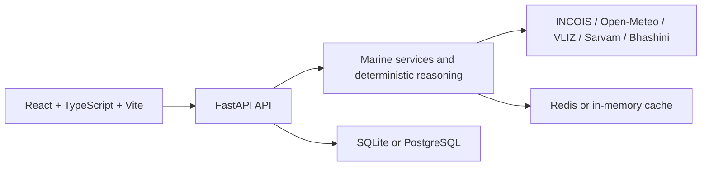

# ORCA Marine AI

ORCA Marine AI is a decision-support platform for coastal mariners and fisheries
operations. It combines marine conditions, fishing-zone intelligence, boundary
awareness, multilingual assistance, and emergency guidance in one responsive
web application.

The project is designed for the Smart India Hackathon (SIH) prototype and final
demonstration. It is not a replacement for official navigation, weather,
maritime safety, or search-and-rescue services.

## Product overview

ORCA helps a user answer practical questions such as:

- Is it operationally safe to go to sea from my selected location?
- What marine conditions and forecast trends should I consider?
- Where are nearby Potential Fishing Zones (PFZs)?
- Am I approaching an EEZ, IMBL, or protected-area boundary?
- Can I receive the advisory in a regional Indian language?
- What information should be included in an emergency MAYDAY message?

The interface includes a dashboard, tactical map, conversational assistant,
alerts, marine services, location selection, settings, and role-aware
administration views.

## Current status

This repository contains a working prototype with live-provider adapters,
deterministic demo scenarios, and explicit provenance indicators.

| Area | Status |
| --- | --- |
| Frontend production build | Passing |
| Frontend automated tests | 161 passing |
| Chat transient-failure retry | Implemented and tested |
| Assistant-to-map return navigation | Implemented and tested |
| SAFE / CAUTION / UNSAFE display mapping | Implemented |
| Backend full-suite validation | Environment-dependent failures remain; see [Validation notes](#validation-notes) |
| Emergency dispatch to authorities | Not integrated |

The prototype must not be represented as having direct Navy, Coast Guard, MRCC,
or rescue-dispatch integration unless an authorized external integration is
configured and independently verified.

## Key capabilities

- **Marine conditions:** normalized wave, wind, forecast, and ocean-state data
  through provider adapters.
- **Risk assessment:** deterministic safety tiers based on decomposed marine
  evidence. Missing or stale required evidence is not treated as safe.
- **PFZ intelligence:** potential fishing zones with distance, bearing, depth,
  and species metadata where data is available.
- **Tactical map:** Leaflet-based map with marine overlays, boundaries, PFZ
  markers, and validated return navigation.
- **Multilingual assistance:** English plus Indian regional language support,
  including localized safety labels and Romanized Indic input handling.
- **Chat reliability:** bounded retry for transient gateway/provider failures
  while preserving request identity for backend deduplication.
- **Voice adapters:** Sarvam and Bhashini integrations when valid credentials
  and provider quota are available.
- **Emergency guidance:** explicit emergency coordinates, MAYDAY script
  generation, and displayed contact information. The prototype does not place
  emergency calls or dispatch rescue services.
- **Role-aware access:** user, government, and super-admin capabilities are
  enforced by the backend.
- **Demo scenarios:** deterministic Mumbai, Surat/Hazira, and Veraval flows for
  repeatable presentations. Demo data is visibly identified in the UI.

## Architecture


```mermaid
flowchart LR
    Browser["React + TypeScript + Vite"]
    API["FastAPI API"]
    Intelligence["Marine services and deterministic reasoning"]
    Providers["INCOIS / Open-Meteo / VLIZ / Sarvam / Bhashini"]
    Storage["SQLite or PostgreSQL"]
    Cache["Redis or in-memory cache"]

    Browser --> API
    API --> Intelligence
    Intelligence --> Providers
    API --> Storage
    Intelligence --> Cache
```

### Frontend

- React 19, TypeScript, Vite 8
- Tailwind CSS v4
- React Router
- Leaflet and React-Leaflet
- Vitest and Testing Library

### Backend

- FastAPI and Uvicorn
- Pydantic contracts
- SQLAlchemy and Alembic
- SQLite for local development, PostgreSQL for deployment
- Redis with an in-memory fallback
- Provider adapters for marine, language, voice, boundary, and emergency
  services

## Repository structure

```text
.
├── backend/
│   ├── app/
│   │   ├── agents/          # Domain reasoning and evidence agents
│   │   ├── data/            # Marine providers, cache, and spatial data
│   │   ├── models/          # Pydantic API contracts
│   │   ├── routers/         # FastAPI route groups
│   │   └── services/        # Business logic and integrations
│   ├── tests/               # Backend automated tests
│   ├── requirements.txt
│   └── .env.example
├── frontend/
│   ├── src/
│   │   ├── components/      # Shared and feature UI
│   │   ├── context/         # Application state
│   │   ├── lib/             # Domain helpers and hooks
│   │   ├── pages/           # Application routes
│   │   └── services/        # API client
│   ├── package.json
│   └── .env.example
├── docs/                    # Readiness, QA, and acceptance records
├── SIH_DEMO_SCRIPT.md       # Guided presentation run sheet
├── FIELD_TESTING_GUIDE.md   # Field validation guidance
└── API_INTEGRATION_CONTRACT.md
```

## Local development

### Prerequisites

- Python 3.11 or newer
- Node.js 20 or newer
- npm
- Optional: PostgreSQL, Redis, and provider credentials

### 1. Configure the backend

```bash
cd backend
python -m venv .venv
source .venv/bin/activate
pip install -r requirements.txt
cp .env.example .env
```

For a local prototype, the default SQLite configuration and in-memory cache
are sufficient. Add only the provider credentials required for the feature
being tested.

### 2. Start the API

```bash
cd backend
source .venv/bin/activate
uvicorn app.main:app --reload --port 8000
```

The API is available at `http://localhost:8000`. Interactive documentation is
available at `/docs` and `/redoc`.

### 3. Configure and start the frontend

```bash
cd frontend
npm install
cp .env.example .env
npm run dev
```

The frontend is available at `http://localhost:5173`.

`frontend/.env` may contain public browser configuration such as:

```dotenv
VITE_API_BASE_URL=http://localhost:8000
VITE_GOOGLE_CLIENT_ID=
```

Never put JWT secrets, database credentials, Sarvam keys, Bhashini keys, or
LLM keys in `VITE_*` variables.

## Demo mode and data provenance

The application supports repeatable demo scenarios so the SIH walkthrough does
not depend on unpredictable upstream conditions. Demo mode must be explicitly
enabled by the deployment configuration and its responses are labeled in the
product.

When reviewing a result, distinguish:

- **Live data:** retrieved from a configured upstream provider and accompanied
  by freshness/source metadata.
- **Cached data:** previously retrieved data served through the cache.
- **Demo scenario:** deterministic data used for repeatable presentation flows.
- **Unavailable:** a provider or required evidence could not be verified.

The system must not convert unavailable, stale, or unverified evidence into a
SAFE recommendation.

## Useful API routes

The complete contract is available through FastAPI's OpenAPI documentation.
Common routes include:

| Method | Route | Purpose |
| --- | --- | --- |
| `POST` | `/api/auth/register` | Create a user account |
| `POST` | `/api/auth/login` | Authenticate and issue a session token |
| `GET` | `/api/user/profile` | Read the authenticated profile |
| `POST` | `/query` | Run a structured marine advisory |
| `POST` | `/api/chat` | Send a conversational assistant message |
| `GET` | `/api/marine/conditions` | Read normalized marine conditions |
| `GET` | `/api/marine/risk` | Read the marine risk assessment |
| `GET` | `/api/marine/forecast` | Read the forecast horizon |
| `POST` | `/api/voice/transcribe` | Transcribe uploaded audio |
| `POST` | `/api/voice/speak` | Generate voice audio |
| `POST` | `/api/emergency/sos` | Create an emergency guidance record |
| `GET` | `/health` | Health probe |

Route availability and required authentication can vary by deployment
configuration. Use `/docs` as the authoritative contract for the running API.

## Validation

Run the frontend checks from the `frontend` directory:

```bash
npm test
npm run build
npm run lint
```

Run backend tests from the repository root:

```bash
pytest -q
```

The full backend suite includes live-provider and environment-sensitive tests.
Missing credentials, unavailable external services, or database configuration
can cause those checks to fail without indicating a regression in the
frontend prototype. For a focused local check, run the relevant module or
marker from `backend/tests`.

Before a public demo, also verify:

1. The intended live or demo provider configuration is active.
2. The selected location, coordinates, risk tier, and map markers agree.
3. Language switching and localized safety labels render correctly.
4. SOS output clearly presents coordinates and contact guidance without
   implying automatic dispatch.
5. The deployed frontend and backend point to the expected commit and
   environment.

## Deployment

The reference deployment uses Vercel for the frontend and Render for the
backend. Deployment manifests are included in `vercel.json`, `render.yaml`,
and `frontend/vercel.json`.

Configure secrets only in the hosting provider's server-side environment
settings. At minimum, production deployments should review:

- `APP_ENV`
- `DATABASE_URL`
- `JWT_SECRET_KEY`
- `FRONTEND_ORIGIN`
- provider API keys and timeout values
- demo-mode and live-provider settings

Do not claim live-data or emergency capabilities until the corresponding
provider integration has been tested in the target environment.

## Documentation

- [SIH demo script](SIH_DEMO_SCRIPT.md)
- [Field testing guide](FIELD_TESTING_GUIDE.md)
- [API integration contract](API_INTEGRATION_CONTRACT.md)
- [Production readiness](docs/PRODUCTION_READINESS.md)
- [Video readiness](docs/VIDEO_READINESS_2026-09-24.md)
- [Stabilization acceptance](docs/STABILIZATION_ACCEPTANCE_2026-09-18.md)

## License and safety

This repository is an SIH prototype. Marine conditions, risk assessments,
boundary information, and emergency guidance are informational decision
support. Operators remain responsible for following official notices,
navigation rules, vessel procedures, and local emergency instructions.
