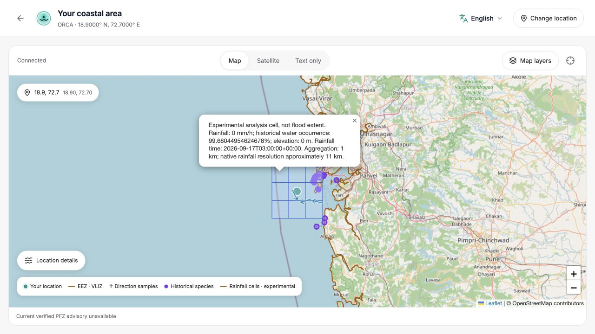
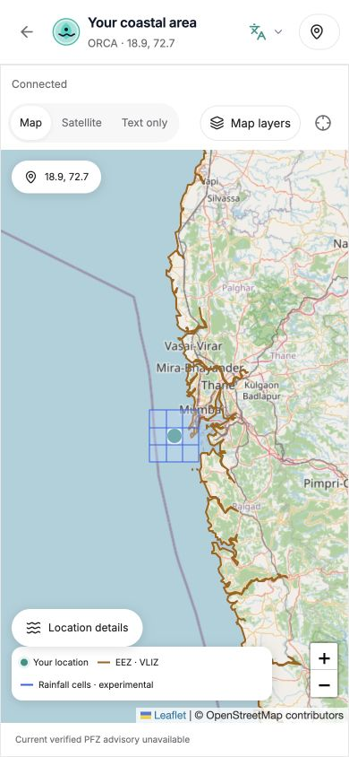
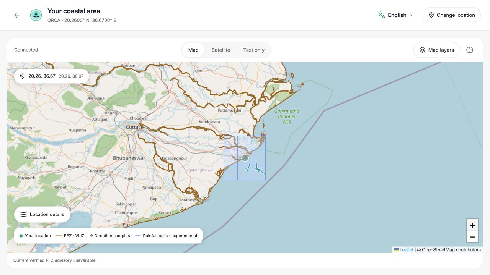

# ORCA feature-depth implementation and verification

18 September 2026. Local implementation checkpoint, **not a production release or feature freeze**.

## 1–3. Baseline, final identity and changed files

- Baseline frontend/backend SHA: `ccae56034e238f4ea13675ed0222c6e3af2554ad`.
- Final HEAD remains that SHA: all implementation changes are **uncommitted** on `codex/feature-depth-leaflet`. No commit, push, deployment, production account mutation or database migration was performed.
- Baseline Vercel/Render/schema evidence: [FEATURE_DEPTH_BASELINE.md](FEATURE_DEPTH_BASELINE.md).
- Backend additions: `models/intelligence.py`; `routers/intelligence.py`; services `earth_observation.py`, `species.py`, `intelligence_cache.py`, `provenance.py`, `display_geometry.py`, `pfz/geometry.py`, `sms.py`; integration verification script and tests.
- Backend changes: main/router registration and chat history trace, snapshot provenance/display geometry/cache version, PFZ geometry validation, requirements, `.env.example`, test isolation and regression assertions.
- Frontend additions: connectivity/intelligence/map-data contracts, OperationalTrace, feature-depth and audio tests.
- Frontend changes: CoastMap/MapPanel, Conditions/SnapshotDetails/Dashboard, AssistantPage/types, VoiceControls/audio encoding, snapshot/API behavior, map styling and tests; favicon/PWA assets, HTML metadata and reproducible favicon generator.
- Documentation: integration requirements, source catalog, baseline, this report, quota/provider evidence and actual browser screenshots. [Changed-file manifest](verification/feature-depth-changed-files.txt); `git status --short` is the current authoritative list.

## 4–7. GIS, screenshot, PFZ semantics and Leaflet decision

Leaflet is retained per the user's explicit choice. No Google Maps spike, migration, key or billing setup was performed. There is therefore **no invented Google-vs-Leaflet timing benchmark**. Both can draw points/circles/polygons; Leaflet already satisfies this task and avoids introducing a new proprietary map-loading dependency. Tile services still have attribution/usage policies and network requirements; retaining Leaflet does not promise unlimited free tiles or offline basemaps.

Implemented: standard/Esri reference satellite, current location, EEZ, enhanced PFZ symbols/popups, per-field direction and model samples, historical OBIS occurrences and optional Earth Engine analysis cells. Advanced layers have source/age/limitations. MPA and hazard extents stay unavailable without geometry.

PFZ: concentric emerald **pixel-sized symbol halos**, not arbitrary geographic confidence circles. A geographic circle requires a supplied advisory search radius; a polygon requires supported supplied geometry/meaning. Popup includes reference, computed distance/bearing, issue/expiry/source/geometry/freshness and Ask ORCA. No actual PFZ advisory was available for the checked locations, so production-like browser screenshots do not fabricate PFZ markers. Point/radius/expiry behavior has automated contract tests; a real advisory popup remains an acceptance gate.

Renderer-independent normalized marine data is in `frontend/src/lib/orca/map-data.ts`; optional evidence contracts are separate from Leaflet.

## 8–9. Earth Engine datasets, access and quotas

Project `team-orbitx-sih26` is accessible locally with ADC. Actual Mumbai and Paradip requests returned nine cells each. Integrated datasets: NASA GPM IMERG V07 rainfall, JRC Global Surface Water v1.4 historical occurrence, SRTM GL1 v3 terrain. Source metadata and limitations: [catalog](DATA_SOURCE_CATALOG.md).

This is experimental context, **not live flood prediction, flood extent, a validated exposure score, bathymetry or a marine-risk override**. GPM native resolution is about 11 km; 1 km reduction sampling does not create finer information. The observation used was roughly 38 hours old. Historical water spans 1984–2021; terrain acquisition is February 2000.

Quota API returned 3,600,000 EECU-seconds/month (1,000 EECU-hours) and 6,000 read requests/minute/project and /user. This is an effective limit, not remaining credit or independent eligibility verification. The published noncommercial tier policy describes reduced throughput after allowance exhaustion. See [quota evidence](verification/earth-engine-quota-2026-09-18.json) and [deployment steps](../INTEGRATION_REQUIREMENTS.md).

## 10–11. Species sources and evidence classes

OBIS public historical occurrence is integrated, bounded and cached. Mumbai produced usable records; Paradip's sampled results had no usable species records after filtering. This is not proof that fish are absent. Results include marine organisms beyond fish and do not answer which fish are present today.

The contract explicitly separates official advisories, habitat suitability and historical occurrence. Only the historical class currently has live integration. INCOIS Tuna's official product description was retrieved; it describes WebGIS/email products and example maps, not a current local machine-readable advisory usable here. No verified Hilsa feed or validated suitability model was established. No species names are hardcoded as current catch predictions.

## 12–14. BHASHINI matrix, Sarvam and voice

Actual BHASHINI inference; short synthesized-speech fixtures, not mocked STT. Typed script-language selection matched the expected code. Translation means nonempty actual HTTP-200 output, not native-speaker semantic grading.

| Language | Script selection | Translation | TTS ms | STT ms | Audio/transcript |
|---|---|---|---:|---:|---|
| English | en | Not needed | 3291 | 1562 | Present |
| Hindi | hi | HTTP 200 | 1304 | 950 | Present |
| Gujarati | gu | HTTP 200 | 1270 | 847 | Present |
| Marathi | mr | HTTP 200 | 1273 | 1033 | Present |
| Bengali | bn | HTTP 200 | 1568 | 936 | Present |
| Tamil | ta | HTTP 200 | 4205 | 2281 | Present |
| Telugu | te | HTTP 200 | 3913 | 961 | Present |
| Malayalam | ml | HTTP 200 | 1480 | 947 | Present |
| Kannada | kn | HTTP 200 | 1084 | 931 | Present |
| Odia | or | HTTP 200 | 1145 | 1130 | Present |
| Punjabi | pa | HTTP 200 | 876 | 1560 | Present |

Evidence: [real provider JSON](verification/feature-integrations-2026-09-18.json). Human noisy speech, long speech, code-switching, microphone/device behavior, meaning/pronunciation review and account quotas are **not accepted yet**. Therefore **Sarvam was not removed**.

Voice cap increased from 30 to 45 seconds, with elapsed-time timer and actual PCM truncation to protect against late browser stop events. Existing real microphone level meter, stop/cancel/editable transcript and sequential conversational mode remain. Browser recording is decoded to mono PCM16 WAV at 16 kHz. No streaming partial transcript or full-duplex claim.

## 15. Network modes and payload audit

FULL/GOOD/DEGRADED/OFFLINE use browser connectivity plus recent API latency/failures and optional network hints. Degraded mode disables satellite/optional data layers and reduces polling; offline shows saved text information without tiles. Cache expiry/safety validity is not extended. Existing encrypted offline trip pack and emergency guidance are preserved. SMS is an unavailable interface, not a delivery claim or deep-sea connectivity solution.

Measured on the local real-provider Mumbai flow. JSON columns use compact UTF-8 serialization; gzip columns use local gzip, so exact wire bytes may differ. API response compression was confirmed by `Content-Encoding: gzip`.

| Payload | Before bytes | After bytes | Gzip after |
|---|---:|---:|---:|
| Full snapshot | 1,869,653 | 462,879 | 172,880 |
| EEZ display geometry | 1,852,356 | about 448,200 | about 170,250 |
| PFZ unavailable record | 165 | 165 | 135 |
| OBIS optional response | — | 26,823 | 3,454 |
| Earth Engine optional response | — | 4,569 | 1,275 |
| Chat request | — | 147 | 144 |
| Actual chat error response | — | 85 | 93 |

The geometry derivative uses topology-preserving 0.002° simplification; original coordinates remain the input to boundary calculations. Roughly 74% compressed snapshot reduction. Successful chat responses still embed the canonical snapshot by contract, so they benefit from the reduction, but a successful live response size was not measured in this run. An immutable geometry-reference API could further deduplicate payloads later; it was not introduced because it changes snapshot/offline contracts.

Production build HTML plus directly referenced entry JS/CSS/runtime/preload assets measured about 704 KB raw / 188 KB gzip before final small edits. This is **not** total initial network transfer: route chunks, logos/fonts, analytics and map tiles are additional. Leaflet's lazy JS chunk is approximately 149 KB raw / 43 KB gzip and is not loaded for text-only maps. Duplicate remote Leaflet CSS was removed. Main entry remains above the 500 KB build warning threshold.

Automated tests cover classifier thresholds, optional-query laziness, degraded layer/satellite behavior, offline tile unmount and reconnect cache reuse. Browser text view/mobile controls were checked. Real throttled-3G and packet-loss/device offline testing remain pending; automated state transitions are not claimed as physical-network verification.

DOM checks found nine successfully loaded Esri tiles at the tested mobile viewport, eighteen successfully loaded OSM tiles at the final desktop east-coast viewport, and zero tile image elements after switching to text-only. These are mounted tile counts, not a cumulative request count or tile-byte benchmark. No offline bulk tile downloading was introduced.

## 16–19. Trace, provenance, catalog and identity

Operational trace includes language selection, intent routing, evidence retrieval, saved risk assessment and response generation. Each stage has status/provider/timestamp and measured elapsed duration; saved risk timing is null, not invented. Trace is persisted in chat metadata and covered by regression assertions. It contains no hidden model reasoning.

Real chat verification hit upstream Gemini 504/503; browser correctly showed provider unavailable. **Successful live trace rendering is not yet verified**, despite persistence tests passing.

`DataProvenance` and clickable metric/full-snapshot details expose value/unit/provider/product/type/grid/valid/retrieved/cache fields and nullable resolutions/satellite/sensor. Atmospheric Open-Meteo values link to weather docs; marine values link to marine docs. [DATA_SOURCE_CATALOG.md](DATA_SOURCE_CATALOG.md) documents all actual canonical parameters and unavailable capabilities.

Favicon: simplified ORCA drop/eye/wave symbol with no text; regenerated ICO16/32/48, PNG16/32, Apple180 and PWA192/512. Source SVG and `tools/generate_favicon.cjs` make it reproducible. 16/32 assets visually inspected; manifest and HTML use cache version 3. Removed fake `gov.in` canonical/social metadata and unsupported ministry authorship. Incognito cache behavior and physical mobile installation remain acceptance tasks.

## 20. Regression and browser evidence

- Initial backend baseline: 476 passed, 12 failed, 5 skipped. Twelve failures were existing Gemini-test `google` namespace pollution. Fixed test isolation only.
- Full backend rerun after geometry/security tests: **502 passed, 5 skipped** in 312 seconds. Subsequent malformed-OBIS and source-link hardening: focused intelligence suite **13 passed**.
- Frontend: **151 passed, 29 files** after final edits; TypeScript + production build passed. Main entry remains 567.68 KB raw / about 165 KB gzip. Lint exited 0 with existing warnings; this is not a warning-free-code claim. `git diff --check` passed.
- Focused backend ownership/trace/geometry/intelligence: 29 passed.
- Actual local login with persisted isolated account → manual Mumbai point → dashboard → map succeeded. No production account was created.
- Actual OBIS and Earth Engine success shown in browser; source timestamps/limitations visible; rainfall-cell popup inspected. Paradip shows OBIS empty and Earth Engine available. EEZ on/off and zoom controls verified. Mobile 390×844 layout and layer scrolling checked; viewport reset afterward. Standard/satellite tile loading and text-only tile removal verified. A wave-card provenance disclosure showed source, grid, valid/retrieved time and unavailable resolution without inventing it.
- No real PFZ advisory, human microphone session or emergency dispatch was fabricated for testing. SOS/admin/offline are automated regression coverage, not field acceptance.

## 21–23. Remaining gates, user actions and freeze status

**Feature freeze is not declared.** Independent local implementation is ready for review, but production and scientific acceptance remain conditional:

1. Configure the backend Earth Engine identity/project securely on Render; confirm noncommercial eligibility and usage. Never paste secrets in chat.
2. Obtain a permission-compatible current PFZ/species advisory feed and authoritative MPA geometry if these must be active in the demo. Otherwise retain explicit unavailable states.
3. Have native speakers test actual phones/microphones in all required languages, including noisy/45-second/code-switched speech. Keep Sarvam until acceptance.
4. Recheck Gemini after its upstream 503/504 failures; verify successful grounded answer and history trace in the browser, then deployed end-to-end behavior.
5. Complete throttled/offline/reconnect field testing, favicon incognito/PWA install checks and final deployment smoke tests. Existing lint warnings/main bundle size still need a focused performance cleanup, not a full redesign.

No new Google Maps key is needed. OBIS requires no key. Existing BHASHINI credentials worked for the stated transport tests. Deployment is a separate step; this report does not imply these changes are live.

## Bounded additional-feature review

Scores are engineering judgments, 1–5 (higher better); time score means faster delivery. No extras were implemented.

| Candidate | Relevance | Demo value | Data availability | Feasibility | Scientific defensibility | Time | Distinctiveness | Decision |
|---|---:|---:|---:|---:|---:|---:|---:|---|
| Official cyclone bulletin context | 5 | 5 | 4 | 4 | 5 | 4 | 3 | Recommend after freeze gates; cite official issue/validity, never invent tracks. |
| Verified harbour/landing contacts and facilities | 5 | 4 | 3 | 4 | 5 | 4 | 3 | Recommend if directory can be validated; no auto-safe routing. |
| Fleet coordination | 4 | 4 | 2 | 2 | 4 | 2 | 4 | Defer: consent, privacy, messaging and connectivity complexity. |
| Environmental anomaly alerts | 4 | 4 | 3 | 2 | 2 | 2 | 4 | Defer: calibrated baselines/false-positive validation needed. |
| Automated safe-return route | 5 | 5 | 1 | 1 | 1 | 1 | 4 | Defer: charts, depth, obstacles and operational validation missing. |

Only the first two are recommended, after current acceptance gates. Do not keep adding features before stabilization.
